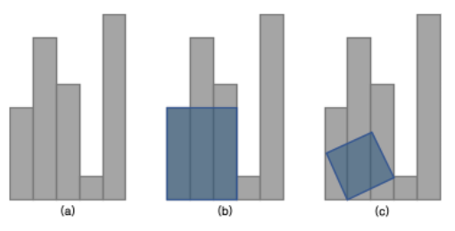

## 제로베이스 프론트엔드 스쿨\_BrokenBridge

### [문제 설명]

넓이가 같은 n개의 나무판자를 붙여 만든 다리가 있습니다. 태풍의 영향으로 다리가 부서지고, 각 나무판자의 길이가 들쭉날쭉하게 잘려 나가서 더욱 튼튼한 철골 다리로 새로 만들기로 했습니다.
이때, 기존 다리의 나무판자 일부를 직사각형으로 잘라 재활용하고자 할 때, 그림 (b)는 다리 (a)에 남겨진 나무판자에서 잘라낼 수 있는 가장 넓은 직사각형이며, 그림 (c)와 같이 비스듬하게 자를 수 없습니다.
나무판자의 길이 배열 l이 주어질 때, 잘라낼 수 있는 직사각형의 최대 넓이를 구하는 함수, solution을 완성해주세요.

### [제한 사항]

모든 나무판자의 넓이는 1이라고 가정합니다.
나무판자의 수직과 수평에 맞춰 잘라야 하며, 비스듬하게 자를 수 없습니다.

### [입력 형식]

왼쪽부터 순서대로 나무판자의 길이 배열 l이 주어집니다.
l은 1 이상 10,000 이하의 정수로 이뤄진 배열입니다.
나무판자의 수 n은 1개 이상 10,000개 이하입니다.

### [출력 형식]

다리에서 잘라낼 수 있는 직사각형의 최대 크기를 int 형식으로 출력합니다.

